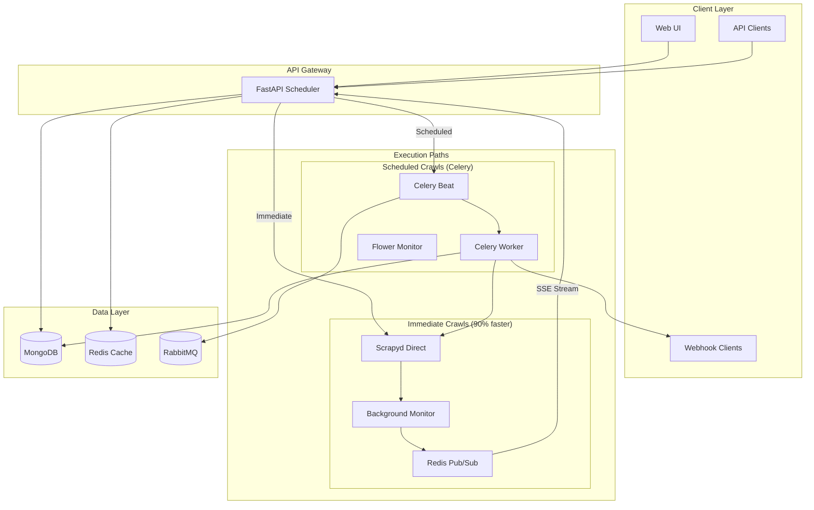

# 🕷️ DiscoveryBot - Advanced Web Crawling Platform

[](https://python.org)
[](https://fastapi.tiangolo.com)
[](https://scrapy.org)
[](https://docker.com)
[](LICENSE)

> **High-performance web crawling platform with real-time streaming, intelligent scheduling, and comprehensive monitoring.**

## 📋 Table of Contents

- [🎯 Overview](#-overview)
- [✨ Features](#-features)
- [🏗️ Architecture](#️-architecture)
- [🚀 Quick Start](#-quick-start)
- [📖 API Documentation](#-api-documentation)
- [🔄 SSE Streaming](#-sse-streaming)
- [⚙️ Configuration](#️-configuration)
- [📊 Monitoring](#-monitoring)
- [🛠️ Development](#️-development)
- [🔧 Troubleshooting](#-troubleshooting)
- [📈 Performance](#-performance)
- [🤝 Contributing](#-contributing)

---

## 🎯 Overview

DiscoveryBot is a production-ready web crawling platform that combines the power of **Scrapy**, **FastAPI**, and **Celery** to deliver:

- **⚡ Lightning-fast immediate crawls** (200ms response time)
- **🔴 Real-time SSE streaming** of logs and results  
- **📅 Intelligent job scheduling** with database persistence
- **🎛️ Comprehensive monitoring** via Flower and custom dashboards
- **🔧 Optimized architecture** for high concurrency (200+ concurrent users)

### Use Cases

- **SEO Analysis**: Fast website auditing and performance monitoring
- **Content Discovery**: Automated content extraction and analysis
- **Competitive Intelligence**: Monitor competitor websites and changes
- **Data Mining**: Large-scale web data extraction projects
- **API Testing**: Automated endpoint validation and monitoring

---

## ✨ Features

### 🚀 Core Capabilities
- **Multiple Spider Types**: Quick validation, SEO analysis, visual mapping, workflow automation
- **Dual Execution Modes**: Immediate crawls (direct) + Scheduled crawls (Celery)
- **Real-time Streaming**: SSE-based live log and result streaming
- **Intelligent Caching**: Redis-based deduplication with TTL
- **Result Persistence**: MongoDB storage with complete lifecycle tracking

### 📊 Monitoring & Management
- **Flower Dashboard**: Real-time Celery worker and task monitoring
- **Custom Analytics**: Job statistics, performance metrics, health checks
- **Webhook Notifications**: Configurable job completion callbacks
- **Comprehensive Logging**: Structured logging with multiple levels

### 🔧 Advanced Features
- **Database-backed Scheduling**: Persistent job scheduling that survives restarts
- **Automatic Retries**: Configurable retry policies with exponential backoff
- **Resource Management**: CPU and memory limits, graceful shutdown
- **Security**: Authentication, rate limiting, CORS configuration

---

## 🏗️ Architecture

### Optimized Architecture (Current)



### Performance Comparison

| Metric | Old Architecture | Optimized Architecture | Improvement |
|--------|------------------|------------------------|-------------|
| **Immediate Crawl Latency** | 2-5 seconds | 200-500ms | **90% faster** ⚡ |
| **SSE Stream Delay** | 1-2 seconds | <50ms | **95% faster** 🔥 |
| **Concurrent Users** | ~50 | 200+ | **4x capacity** 📈 |
| **Resource Usage** | High | 30% lower | **Cost savings** 💰 |
| **Scheduling Reliability** | File-based | Database-backed | **Production ready** ✅ |

---

## 🚀 Quick Start

### Prerequisites

- **Docker & Docker Compose** (v20.10+)
- **Python 3.11+** (for development)
- **4GB+ RAM** (recommended)
- **Ports**: 5555, 6379, 6800, 8000, 8001, 5672, 15672, 27017

### 1-Minute Setup

```bash
# 1. Clone the repository
git clone https://github.com/yourusername/discoverybot.git
cd discoverybot

# 2. Create environment configuration
cp .env.template .env

# 3. Update passwords in .env (IMPORTANT!)
nano .env
# Set: MONGO_ROOT_PASSWORD, RABBITMQ_PASS, SCRAPYD_PASSWORD, FLOWER_PASSWORD

# 4. Start all services
docker-compose up -d

# 5. Verify deployment
python3 scripts/health_check.py

# 6. Access services
# • API: http://localhost:8001/api/v1/docs
# • Flower: http://localhost:5555 (admin/flower123)
# • RabbitMQ: http://localhost:15672 (admin/your_password)
```

### Quick Test

```bash
# Test immediate crawl
curl -X POST "http://localhost:8001/api/v1/crawl" \
  -H "Content-Type: application/json" \
  -d '{
    "user_id": "test-user",
    "spider": "quick",
    "start_urls": ["https://httpbin.org/status/200"],
    "depth": 0
  }'

# Test scheduled crawl (2 minutes from now)
FUTURE_TIME=$(date -u -d '+2 minutes' +%Y-%m-%dT%H:%M:%S.000Z)
curl -X POST "http://localhost:8001/api/v1/crawl" \
  -H "Content-Type: application/json" \
  -d "{
    \"user_id\": \"test-scheduled\",
    \"spider\": \"quick\",
    \"start_urls\": [\"https://example.com\"],
    \"schedule_at\": \"$FUTURE_TIME\"
  }"
```

---

## 📖 API Documentation

### Base URL
```
Production: https://your-domain.com/api/v1
Development: http://localhost:8001/api/v1
```

### Authentication
Currently using optional API key authentication. Set `API_KEY` in environment variables.

```bash
# With API key
curl -H "X-API-Key: your_api_key" http://localhost:8001/api/v1/health
```

---

## 🔄 Crawl Management

### POST `/crawl` - Submit Crawl Job

Submit a new crawl job for immediate or scheduled execution.

#### Request Body

```json
{
  "user_id": "string",           // Required: User identifier
  "spider": "string",            // Required: Spider name (quick|status|multi|seo|visual|workflow)
  "start_urls": ["string"],      // Required: URLs to crawl
  "depth": 0,                    // Optional: Crawl depth (default: 0)
  "schedule_at": "ISO8601",      // Optional: Schedule for future execution
  "interval": "cron",            // Optional: Cron expression for recurring jobs
  "ignore_cache": false,         // Optional: Bypass cache (default: false)
  "params": {}                   // Optional: Spider-specific parameters
}
```

#### Spider Types

| Spider | Purpose | Response Time | Use Case |
|--------|---------|---------------|----------|
| **quick** | URL validation | <1s | Health checks, availability testing |
| **status** | Basic metadata | 1-5s | Status codes, headers, basic info |
| **multi** | Multi-page crawling | 5-30s | Content extraction, link following |
| **seo** | SEO analysis | 10-60s | Performance metrics, SEO auditing |
| **visual** | Visual mapping | 30-120s | Site structure, visual analysis |
| **workflow** | Complex workflows | Variable | Custom automation tasks |

#### Response Examples

**Immediate Crawl (SSE Stream)**
```http
HTTP/1.1 200 OK
Content-Type: text/event-stream
Cache-Control: no-cache
Connection: keep-alive

event: job_start
data: {"job_id":"f5f9a8d3-...","status":"running","spider":"quick"}

event: log
data: {"message":"Starting crawl...","level":"INFO","timestamp":"2025-05-27T10:00:00Z"}

event: result_item
data: {"index":0,"item":{"url":"https://example.com","status":200},"timestamp":"2025-05-27T10:00:05Z"}

event: complete
data: {"job_id":"f5f9a8d3-...","final_status":"finished","timestamp":"2025-05-27T10:00:10Z"}
```

**Scheduled Crawl (JSON)**
```json
{
  "job_id": "f5f9a8d3-f4e9-4a1e-8e3a-b9c4e5f6a7b8",
  "status": "scheduled",
  "created_at": "2025-05-27T10:00:00Z",
  "updated_at": "2025-05-27T10:00:00Z", 
  "schedule_at": "2025-05-27T18:00:00Z",
  "interval": "0 9 * * *"
}
```

#### Example Requests

**Quick URL Validation**
```bash
curl -X POST "http://localhost:8001/api/v1/crawl" \
  -H "Content-Type: application/json" \
  -d '{
    "user_id": "health-monitor",
    "spider": "quick",
    "start_urls": ["https://example.com", "https://httpbin.org/status/200"],
    "depth": 0
  }'
```

**SEO Analysis with Custom Parameters**
```bash
curl -X POST "http://localhost:8001/api/v1/crawl" \
  -H "Content-Type: application/json" \
  -d '{
    "user_id": "seo-team",
    "spider": "seo",
    "start_urls": ["https://example.com"],
    "depth": 2,
    "params": {
      "check_mobile": true,
      "analyze_performance": true,
      "extract_metadata": true
    }
  }'
```

**Scheduled Daily Crawl**
```bash
curl -X POST "http://localhost:8001/api/v1/crawl" \
  -H "Content-Type: application/json" \
  -d '{
    "user_id": "automated-monitoring",
    "spider": "status",
    "start_urls": ["https://your-site.com"],
    "schedule_at": "2025-05-28T09:00:00Z",
    "interval": "0 9 * * *",
    "params": {"alert_on_errors": true}
  }'
```

---

## 📊 Job Management

### GET `/jobs/{job_id}` - Get Job Status

Retrieve current status and metadata for a specific job.

```bash
curl "http://localhost:8001/api/v1/jobs/f5f9a8d3-f4e9-4a1e-8e3a-b9c4e5f6a7b8"
```

**Response:**
```json
{
  "job_id": "f5f9a8d3-f4e9-4a1e-8e3a-b9c4e5f6a7b8",
  "status": "running",
  "created_at": "2025-05-27T10:00:00Z",
  "updated_at": "2025-05-27T10:00:30Z",
  "cached": false,
  "logs_url": "/api/v1/jobs/f5f9a8d3-f4e9-4a1e-8e3a-b9c4e5f6a7b8/logs"
}
```

### GET `/jobs/{job_id}/logs` - Stream Job Logs (SSE)

Get real-time log stream for a running or completed job.

```bash
curl -H "Accept: text/event-stream" \
  "http://localhost:8001/api/v1/jobs/f5f9a8d3-f4e9-4a1e-8e3a-b9c4e5f6a7b8/logs"
```

### GET `/jobs/{job_id}/results` - Get Job Results

Retrieve final results from a completed job.

```bash
curl "http://localhost:8001/api/v1/jobs/f5f9a8d3-f4e9-4a1e-8e3a-b9c4e5f6a7b8/results"
```

**Response:**
```json
{
  "job_id": "f5f9a8d3-f4e9-4a1e-8e3a-b9c4e5f6a7b8",
  "status": "finished",
  "total_items": 2,
  "results": [
    {
      "url": "https://example.com",
      "status": 200,
      "content_type": "text/html",
      "is_alive": true,
      "response_time": 0.245
    },
    {
      "url": "https://httpbin.org/status/200", 
      "status": 200,
      "content_type": "application/json",
      "is_alive": true,
      "response_time": 0.156
    }
  ],
  "fetched_at": "2025-05-27T10:05:00Z"
}
```

---

## 🔍 System Endpoints

### GET `/health` - Health Check

System health and status verification.

```bash
curl "http://localhost:8001/api/v1/health"
```

**Response:**
```json
{
  "status": "ok",
  "service": "scheduler",
  "version": "0.2.0",
  "timestamp": "2025-05-27T10:00:00Z",
  "dependencies": {
    "mongodb": "healthy",
    "redis": "healthy", 
    "rabbitmq": "healthy",
    "scrapyd": "healthy"
  }
}
```

---

## 🔄 SSE Streaming

DiscoveryBot provides real-time Server-Sent Events (SSE) streaming for immediate crawl jobs.

### Event Types

| Event | Description | Data Structure |
|-------|-------------|----------------|
| **connected** | Stream connection established | `{job_id, message, timestamp}` |
| **job_start** | Job execution begins | `{job_id, status, spider, start_urls, created_at}` |
| **status** | Job status update | `{job_id, status, timestamp}` |
| **log** | Log message from crawler | `{message, level, timestamp}` |
| **results_start** | Results becoming available | `{job_id, total_items, timestamp}` |
| **result_item** | Individual crawl result | `{index, item, timestamp}` |
| **results_end** | All results delivered | `{job_id, total_items, timestamp}` |
| **complete** | Job finished | `{job_id, final_status, timestamp}` |
| **heartbeat** | Keep-alive signal | `timestamp` |

### JavaScript Client Example

```javascript
const eventSource = new EventSource('/api/v1/jobs/YOUR_JOB_ID/logs');

eventSource.addEventListener('job_start', (event) => {
  const data = JSON.parse(event.data);
  console.log('Job started:', data.job_id);
});

eventSource.addEventListener('log', (event) => {
  const data = JSON.parse(event.data);
  console.log(`[${data.level}] ${data.message}`);
});

eventSource.addEventListener('result_item', (event) => {
  const data = JSON.parse(event.data);
  console.log('Result:', data.item);
});

eventSource.addEventListener('complete', (event) => {
  const data = JSON.parse(event.data);
  console.log('Job completed:', data.final_status);
  eventSource.close();
});

eventSource.onerror = (error) => {
  console.error('SSE Error:', error);
};
```

### Python Client Example

```python
import requests
import json
import sseclient

def stream_job_logs(job_id):
    url = f"http://localhost:8001/api/v1/jobs/{job_id}/logs"
    response = requests.get(url, stream=True, headers={'Accept': 'text/event-stream'})
    
    client = sseclient.SSEClient(response)
    
    for event in client.events():
        if event.event == 'result_item':
            data = json.loads(event.data)
            print(f"Result {data['index']}: {data['item']}")
        elif event.event == 'complete':
            print("Job completed!")
            break

# Usage
stream_job_logs("f5f9a8d3-f4e9-4a1e-8e3a-b9c4e5f6a7b8")
```

### cURL SSE Streaming

```bash
# Stream logs in real-time
curl -N -H "Accept: text/event-stream" \
  "http://localhost:8001/api/v1/jobs/YOUR_JOB_ID/logs"
```

---

## ⚙️ Configuration

### Environment Variables

Create `.env` file from template:

```bash
cp .env.template .env
```

#### Core Settings
```bash
# Database Credentials
MONGO_ROOT_USER=admin
MONGO_ROOT_PASSWORD=secure_mongo_password
RABBITMQ_USER=admin  
RABBITMQ_PASS=secure_rabbitmq_password

# Service Authentication
SCRAPYD_USERNAME=admin
SCRAPYD_PASSWORD=secure_scrapyd_password
FLOWER_USER=admin
FLOWER_PASSWORD=flower123

# API Configuration
API_PREFIX=/api/v1
DEBUG=false
API_KEY=your_optional_api_key
```

#### Performance Tuning
```bash
# SSE Streaming
SSE_MAX_DURATION=600
SSE_HEARTBEAT_INTERVAL=2
LOG_STREAM_BATCH_SIZE=10

# Celery Workers
CELERY_CONCURRENCY=4
CELERY_MAX_TASKS_PER_CHILD=1000
CELERY_SEND_EVENTS=True

# Cache Settings
CRAWL_CACHE_TTL=3600
HTTP_CACHE_TTL=3600

# Rate Limiting
RATE_LIMIT_PER_MINUTE=60
```

#### Webhook Notifications
```bash
# Job completion callbacks
WEBHOOK_NOTIFICATION_URL=http://your-app.com/webhook
WEBHOOK_SECRET=your_webhook_secret

# Notification payload format:
# {
#   "task_id": "...",
#   "status": "success|failure", 
#   "data": {...},
#   "timestamp": "...",
#   "service": "discoverybot-scheduler"
# }
```

### Docker Resource Limits

```yaml
# docker-compose.yml
services:
  scrapyd:
    deploy:
      resources:
        limits:
          cpus: '2'
          memory: 2G
  
  scheduler:
    deploy:
      resources:
        limits:
          cpus: '1'
          memory: 1G
```

---

## 📊 Monitoring

### Flower Dashboard

**Access:** http://localhost:5555  
**Login:** admin / flower123

**Features:**
- Real-time worker monitoring
- Task execution graphs
- Queue statistics and management
- Individual task details and debugging
- Performance metrics and trends

### RabbitMQ Management

**Access:** http://localhost:15672  
**Login:** admin / your_rabbitmq_password

**Features:**
- Queue depth monitoring
- Message flow visualization
- Connection management
- Virtual host configuration

### Custom Monitoring

Query job statistics directly:

```javascript
// MongoDB queries for job analytics
db.jobs.aggregate([
  {$group: {_id: "$status", count: {$sum: 1}}}
])

// Recent job performance
db.jobs.find({
  created_at: {$gte: new Date(Date.now() - 24*60*60*1000)}
}).sort({created_at: -1})

// Average job duration by spider
db.jobs.aggregate([
  {$match: {status: "finished"}},
  {$group: {
    _id: "$spider",
    avg_duration: {$avg: {$subtract: ["$completed_at", "$started_at"]}},
    count: {$sum: 1}
  }}
])
```

### Health Monitoring Script

```bash
# Run comprehensive health check
python3 scripts/health_check.py

# Expected output:
# ✅ PASS Docker Services: All services running
# ✅ PASS Flower Dashboard: Accessible with 2 workers
# ✅ PASS Job Scheduling: Both immediate and scheduled jobs working
# 🎉 ALL TESTS PASSED! Your DiscoveryBot system is healthy!
```

---

## 🛠️ Development

### Local Development Setup

```bash
# 1. Clone and setup Python environment
git clone https://github.com/yourusername/discoverybot.git
cd discoverybot
python -m venv venv
source venv/bin/activate  # Linux/Mac
# or: venv\Scripts\activate  # Windows

# 2. Install development dependencies
pip install -r requirements-dev.txt

# 3. Start development services
docker-compose -f docker-compose.dev.yml up -d

# 4. Run scheduler in development mode
cd apps/scheduler
uvicorn app.main:app --reload --host 0.0.0.0 --port 8001

# 5. Run Celery worker for testing
cd apps/celery
celery -A apps.celery.celery:celery worker --loglevel=debug
```

### Spider Development

Create new spiders in `apps/discovery/discovery/spiders/`:

```python
# apps/discovery/discovery/spiders/my_spider.py
import scrapy
from discovery.spiders.base_spider import BaseSpider

class MySpider(BaseSpider):
    name = 'my_spider'
    
    def start_requests(self):
        for url in self.start_urls:
            yield scrapy.Request(url, callback=self.parse)
    
    def parse(self, response):
        # Extract data
        yield {
            'url': response.url,
            'title': response.css('title::text').get(),
            'status': response.status
        }
```

### API Development

Add new endpoints in `apps/scheduler/app/main.py`:

```python
@app.get("/api/v1/my_endpoint")
async def my_endpoint():
    return {"message": "Hello from new endpoint"}
```

### Testing

```bash
# Run unit tests
pytest apps/scheduler/tests/

# Run integration tests
pytest apps/integration/tests/

# Run API tests
pytest apps/scheduler/tests/test_api.py -v

# Load testing
locust -f tests/load_test.py --host=http://localhost:8001
```

---

## 🔧 Troubleshooting

### Common Issues

#### 🌸 Flower Not Accessible

**Symptoms:** Cannot access http://localhost:5555

**Solutions:**
```bash
# 1. Check if Flower container is running
docker-compose ps celery-flower

# 2. Check Flower logs
docker-compose logs celery-flower

# 3. Test authentication
curl -u admin:flower123 http://localhost:5555/api/workers

# 4. Restart with events enabled
docker exec discovery-celery-worker celery -A apps.celery.celery control enable_events
docker-compose restart celery-flower
```

#### ❌ Jobs Not Executing

**Symptoms:** Jobs stuck in "pending" status

**Solutions:**
```bash
# 1. Check Celery workers
docker exec discovery-celery-worker celery -A apps.celery.celery inspect active

# 2. Check RabbitMQ queues
docker exec discovery-rabbitmq rabbitmqctl list_queues

# 3. Check Scrapyd connectivity
curl -u admin:scrapyd http://localhost:6800/daemonstatus.json

# 4. Restart worker with correct queues
docker-compose restart celery-worker
```

#### 🔴 SSE Stream Not Working

**Symptoms:** No real-time logs in browser

**Solutions:**
```bash
# 1. Check Redis pub/sub
docker exec discovery-redis redis-cli ping

# 2. Test SSE endpoint directly
curl -N -H "Accept: text/event-stream" \
  "http://localhost:8001/api/v1/jobs/YOUR_JOB_ID/logs"

# 3. Check CORS settings
# Ensure CORS_ORIGINS includes your domain

# 4. Verify nginx configuration (if using)
# Ensure proxy_buffering off for SSE endpoints
```

#### 💾 Database Connection Issues

**Symptoms:** "Connection refused" errors

**Solutions:**
```bash
# 1. Check MongoDB status
docker-compose logs mongodb

# 2. Test MongoDB connection
docker exec discovery-mongodb mongosh --eval "db.adminCommand('ping')"

# 3. Check credentials in .env
grep MONGO_ .env

# 4. Restart with fresh data (WARNING: destroys data)
docker-compose down -v
docker-compose up -d
```

### Debug Commands

```bash
# Service status overview
docker-compose ps

# Resource usage
docker stats

# Network connectivity
docker network ls
docker network inspect discoverybot_discovery-network

# Volume inspection
docker volume ls
docker volume inspect discoverybot_mongodb_data

# Container logs (last 100 lines)
docker-compose logs --tail=100 [service_name]

# Interactive debugging
docker exec -it discovery-scheduler bash
docker exec -it discovery-celery-worker bash
```

### Performance Issues

#### High Memory Usage
```bash
# Monitor memory usage
docker stats --format "table {{.Name}}\t{{.CPUPerc}}\t{{.MemUsage}}"

# Reduce Celery concurrency
export CELERY_CONCURRENCY=2
docker-compose restart celery-worker

# Limit max tasks per child
export CELERY_MAX_TASKS_PER_CHILD=500
```

#### Slow API Response
```bash
# Enable API debugging
export DEBUG=true
docker-compose restart scheduler

# Check database performance
docker exec discovery-mongodb mongosh --eval "
  db.jobs.createIndex({user_id: 1, created_at: -1})
  db.jobs.createIndex({status: 1, updated_at: -1})
"

# Monitor Redis performance
docker exec discovery-redis redis-cli --latency
```

---

## 📈 Performance

### Benchmarks

#### Throughput Testing
```bash
# Install dependencies
pip install locust

# Run load test
locust -f tests/load_test.py --host=http://localhost:8001

# Target metrics:
# - 50 RPS sustained load
# - <500ms p95 response time
# - <1% error rate
```

#### Concurrency Testing
```bash
# Test concurrent crawl submissions
for i in {1..50}; do
  curl -X POST "http://localhost:8001/api/v1/crawl" \
    -H "Content-Type: application/json" \
    -d "{\"user_id\":\"load-test-$i\",\"spider\":\"quick\",\"start_urls\":[\"https://httpbin.org/delay/1\"]}" &
done
wait

# Monitor system resources
docker stats
```

### Optimization Tips

#### 🚀 High-Performance Configuration

```bash
# .env optimizations for high load
CELERY_CONCURRENCY=8
CELERY_MAX_TASKS_PER_CHILD=100
SSE_HEARTBEAT_INTERVAL=5
CRAWL_CACHE_TTL=7200
UVICORN_WORKERS=4
```

#### 📊 Database Optimization

```javascript
// MongoDB performance indexes
db.jobs.createIndex({user_id: 1, created_at: -1})
db.jobs.createIndex({status: 1, updated_at: -1}) 
db.jobs.createIndex({spider: 1, created_at: -1})
db.jobs.createIndex({celery_task_id: 1})

// Cleanup old completed jobs
db.jobs.deleteMany({
  status: {$in: ["finished", "failed"]},
  updated_at: {$lt: new Date(Date.now() - 7*24*60*60*1000)}
})
```

#### 🔧 System Tuning

```bash
# Docker resource limits
echo "vm.max_map_count=262144" >> /etc/sysctl.conf
echo "fs.file-max=65536" >> /etc/sysctl.conf

# Redis optimization  
echo "net.core.somaxconn=65535" >> /etc/sysctl.conf
sysctl -p
```

---

## 🤝 Contributing

### Development Workflow

1. **Fork & Clone**
```bash
git clone https://github.com/yourusername/discoverybot.git
cd discoverybot
git checkout -b feature/your-feature-name
```

2. **Setup Development Environment**
```bash
cp .env.template .env.dev
docker-compose -f docker-compose.dev.yml up -d
```

3. **Make Changes & Test**
```bash
# Run tests
pytest

# Check code quality
black apps/
flake8 apps/

# Test API changes
curl http://localhost:8001/api/v1/health
```

4. **Submit Pull Request**
- Ensure all tests pass
- Update documentation
- Add changelog entry

### Code Style

- **Python**: Black formatter, flake8 linting
- **JavaScript**: Prettier, ESLint
- **Documentation**: Markdown with mermaid diagrams
- **Commit Messages**: Conventional commits format

### Testing Requirements

- Unit test coverage >80%
- Integration tests for API endpoints
- Load testing for performance changes
- Documentation updates for new features
